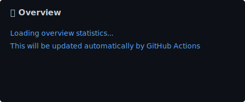
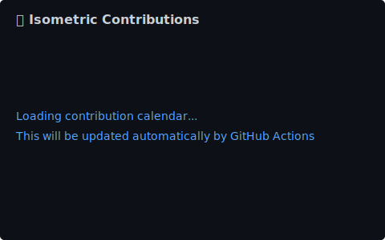
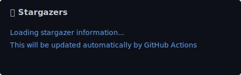

<div id="header" align="center">
  
</div>
<div id="badges"align="center">

  <a href="https://www.linkedin.com/in/A-Hemeda/">
    
  </a>
  <a href="mailto:7hemeda@gmail.com">
    
  </a>
  <a href="https://x.com/11Hemeda">
    
  </a>
  <a href="https://www.facebook.com/11Hemeda">
    
  </a>
  <a href="https://www.youtube.com/@A-Hemeda">
    
  </a>
  <a href="https://codeforces.com/profile/11Hemeda">
    
  </a>
  <a href="https://leetcode.com/u/11Hemeda">
    
  </a>
  <a href="https://www.whatsapp.com/channel/0029Vb3QWNLG8l5OPthU963O">
    
  </a>
  <a href="https://stackoverflow.com/users/28317461/ahmed-hemeda">
    
  </a>
  
</div>
<div id="header1" align="center">
  
  
  
  
</div>
<div id="view" align="center">

[](https://git.io/typing-svg)
<h1>
  Hi.
</h1>
</div>

<div align="center">
  
</div>

---
### 👨‍💻 About Me

I am a motivated **AI/ML Engineer** and a recent Computer Science graduate from **Suez Canal University** (Grade: Very Good). I specialize in building end-to-end Machine Learning solutions, from data analysis and preprocessing to model development and deployment. My passion lies in Deep Learning, Computer Vision, and creating intuitive applications using Python.

<br/>

```python
class AI_Engineer:
    def __init__(self):
        self.name = "Ahmed Mohamed"
        self.role = "AI/Machine Learning Engineer"
        self.education = "B.Sc. Computer Science (Suez Canal University)"
        self.location = "Ismailia, Egypt"
        
    def get_skills(self):
        return {
            "Core": ["Python", "Data Structures", "Algorithms"],
            "AI_ML": ["TensorFlow", "PyTorch", "Scikit-learn", "Computer Vision"],
            "Deployment": ["FastAPI", "Docker", "Desktop Apps (Tkinter)"]
        }
    
    def say_hi(self):
        print("Welcome to my profile! Let's build something amazing with AI. 🚀")
```

<br/>

---

### 🛠️ Tech Stack

<div align="center">
  
  
  
  
  
  
  
</div>

<div align="center">
  
  
  
  
  
  
  
</div>

<div align="center">
  
  
  
  
  
  
</div>

---

### :fire: My Stats :
<div align="center">
  
[](https://github.com/A-Hemeda?tab=repositories)
  
<!--[](https://github.com/A-Hemeda?tab=repositories)-->
[](https://github.com/A-Hemeda?tab=repositories) <!--(https://github.com/anuraghazra/github-readme-stats)-->

---

<table><tr><td valign="top" width="50%">

<br>



</td><td valign="top" width="50%">



</td></tr></table>

<table><tr><td valign="top" width="50%">


</td><td valign="top" width="50%">



</td></tr></table>

</details>

---


---


---

 [](https://github.com/A-Hemeda?tab=repositories)<!--(https://github.com/ryo-ma/github-profile-trophy)-->
</div>
 
---
 
### 📜 Certifications

- **Supervised Machine Learning: Regression and Classification** - DeepLearning.AI & Stanford University (Coursera)
- **Python Project: pillow, tesseract, and OpenCV** - University of Michigan (Coursera)


